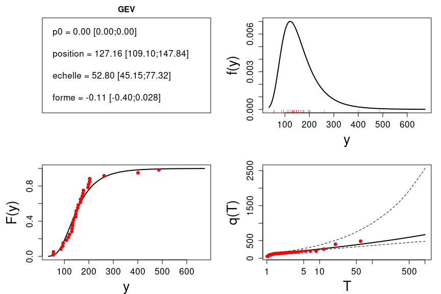

HydroPortailStats
================

[](https://zenodo.org/badge/latestdoi/424274482)

# Introduction

This R package contains the statistical functions used in the French
[`HydroPortail`](https://hydro.eaufrance.fr/). This includes functions
to estimate distributions, quantile curves and uncertainties, along with
various other utilities.

*Ce package R contient les fonctions statistiques utilisées par
l’[`HydroPortail`](https://hydro.eaufrance.fr/). Ceci inclut des
fonctions pour estimer les paramètres d’une distribution, calculer les
courbes de quantiles et leur incertitude, et d’autres outils variés.*

``` r
install.packages('HydroPortailStats')  # Install the package from CRAN
#devtools::install_github('benRenard/HydroPortailStats') # Install the development version from GitHub
library(HydroPortailStats) # Load the package
```

**Important warning**: many distributions are available in
`HydroPortailStats`, but for some of them the parameterization may
differ from the one used in e.g. Wikipedia or other R packages. The
dataset `distInfo` provides information on the distributions as they are
used in `HydroPortailStats`: it is highly advised to read this
information before using a distribution. Try the following:

**Avertissement important**: *de nombreuses distributions sont
disponibles dans `HydroPortailStats`, mais pour certaines d’entre elles
le paramétrage utilisé diffère de celui utilisé dans Wikipedia ou dans
d’autres packages R. Le dataset `distInfo` décrit les distributions
telles qu’elles sont utilisées dans `HydroPortailStats`: il est
fortement recommandé de prendre connaissance de ces informations avant
d’utiliser une distribution. Les commandes suivantes sont utiles:*

``` r
# Show available distributions / Liste des distributions disponibles
names(distInfo)
```

    ##  [1] "Uniform"       "Normal"        "LogNormal"     "Gumbel"       
    ##  [5] "Exponential1"  "Exponential2"  "GEV"           "GPD2"         
    ##  [9] "GPD3"          "Poisson"       "PearsonIII"    "LogPearsonIII"
    ## [13] "Gumbel_min"    "GEV_min"       "GEV_min_pos"   "FlatPrior"

``` r
# information on e.g. the Generalized Extreme Value (GEV) distribution / Information sur la GEV (par exemple)
distInfo[['GEV']]
```

    ## $parName
    ## [1] "location" "scale"    "shape"   
    ## 
    ## $parLongName
    ## [1] "location" "scale"    "shape"   
    ## 
    ## $parSymbol
    ## [1] "mu"    "sigma" "xi"   
    ## 
    ## $constraints
    ## [1] "sigma>0"
    ## 
    ## $url
    ## [1] "https://en.wikipedia.org/wiki/Generalized_extreme_value_distribution"
    ## 
    ## $note
    ## [1] "xi=0 leads to the Gumbel distribution"
    ## 
    ## $warning
    ## [1] "xi < 0 corresponds to a heavy right tail, xi > 0 to a right-bounded distribution. This is THE OPPOSITE of the parameterization used in e.g. wikipedia or R package evd"

# Getting started / Premiers pas

Let’s start by creating a dataset that will be used to estimate a
distribution.

*Commençons par créer un jeu de données qui sera utilisé pour estimer
une distribution.*

``` r
n=30 # sample size / taille de l'échantillon
dist='GEV' # chosen distribution / distribution
param=c(100,50,-0.2) # parameter vector / paramètres de la distribution
y<-Generate(dist=dist,par=param,n=n) # generate data / simulation des données
plot(y,type='b') 
```

<!-- -->

The main function of this package is `Hydro3_Estimation` (‘Hydro3’ is
the name given to the current hydrometric data management system in
France, which includes `HydroPortail`). The line of code below performs
estimation with default options (see ?Hydro3_Estimation)

*La fonction principale de ce package est `Hydro3_Estimation` (‘Hydro3’
est le nom de l’actuel système de gestion des données hydrométriques en
France, dont fait partie l’`HydroPortail`). La ligne de code ci-dessous
effectue une estimation en utilisant les options par défaut (voir
?Hydro3_Estimation)*

``` r
h3=Hydro3_Estimation(y=y,dist=dist)
```

The `h3` variable is a list containing all results of the estimation. A
detailled description is given in the help (?Hydro3_Estimation), but in
short `h3` contains all the information displayed in the plot below.

*La variable `h3` est une liste contenant tous les résultats de
l’estimation. Une description détaillée est fournie dans l’aide
(?Hydro3_Estimation), mais pour résumer `h3` contient toutes les
informations visibles dans le graphique ci-dessous.*

``` r
 # Plot summarizing the results of Hydro3_Estimation / graphique résumant le résultat de Hydro3_Estimation
Hydro3_Plot(h3)
```

<!-- -->

Two functions are available for interactive estimation of Q=f(T)
(quantile for a given return period) or T=f(Q) (return period associated
with a given value). In both cases the result includes an uncertainty
interval.

*Deux fonctions sont fournies pour une estimation interactive Q=f(T)
(quantile pour une période de retour donnée) ou T=f(Q) (période de
retour associée à une valeur). Dans les deux cas le résultat inclut un
intervalle d’incertitude.*

``` r
# 100-year value / valeur centennale
GetQfromT(100,H3=h3)
```

    ## $q
    ## [1] 497.4096
    ## 
    ## $IC
    ## [1] 305.3913 812.0349

``` r
# Return period of value 250 / période de retour de la valeur 250
GetTfromQ(250,H3=h3)
```

    ## $RP
    ## [1] 8.486092
    ## 
    ## $IC
    ## [1]  5.22097 24.11926

# Estimation and uncertainty quantification methods / Méthodes d’estimation et de quantification des incertitudes

Available estimation methods are ‘LMOM’ (L-Moments, default), ‘MOM’
(Moments), ‘ML’ (Maximum Likelihood) and ‘BAY’ (Bayesian). Available
uncertainty quantification methods are ‘PBOOT’ (Parametric bootstrap,
default), ‘BOOT’ (Bootstrap, not recommended), ‘NONE’, ‘ML’ (only usable
when estimation method is ‘ML’ as well) and ‘BAY’ (the only usable
method when estimation method is ‘BAY’). As an illustration, moment
estimation is used below, with parametric bootstrap for quantifying
uncertainty.

*Les méthodes d’estimation disponibles sont ‘LMOM’ (L-Moments, défaut),
‘MOM’ (Moments), ‘ML’ (Maximum de vraisemblance) et ‘BAY’ (Bayesien).
Les méthodes de quantification des incertitudes disponibles sont ‘PBOOT’
(Bootstrap paramétrique, défault), ‘BOOT’ (Bootstrap classique, non
recommandé), ‘NONE’ (pas de quantification des incertitudes), ‘ML’
(seulement utilisable quand la méthode d’estimation est également ‘ML’)
et ‘BAY’ (la seule méthode utilisable quand la méthode d’estimation est
également ‘BAY’). En guise d’illustration, une estimation par la méthode
des moments est effectuée ci-dessous, avec du Bootstrap paramétrique
pour les incertitudes.*

``` r
h3=Hydro3_Estimation(y=y,dist=dist,Emeth="MOM",Umeth="PBOOT")
Hydro3_Plot(h3)
```

<!-- -->

Maximum likelihood estimation:

*Estimation par maximum de vraisemblance:*

``` r
h3=Hydro3_Estimation(y=y,dist=dist,Emeth="ML",Umeth="ML")
Hydro3_Plot(h3)
```

<!-- -->

It is possible to skip uncertainty quantification (but why would you?)

*Il est possible de zapper la quantification des incertitudes (mais
c’est pas bien!)*

``` r
h3=Hydro3_Estimation(y=y,dist=dist,Emeth="ML",Umeth="NONE")
Hydro3_Plot(h3)
```

<!-- -->

Some combinations are proscribed; for instance, uncertainty
quantification Umeth=“ML” is only allowed with estimation method
Emeth=“ML”.

*Certaines combinaisons sont interdites; par exemple, la quantification
des incertitudes “ML” ne marche qu’avec la méthode d’estimation “ML”.*

``` r
h3=Hydro3_Estimation(y=y,dist=dist,Emeth="LMOM",Umeth="ML")
h3$u$message # Look at error message in h3$u (uncertainty results) / Message d'erreur dans h3$u (contenant les incertitudes)
```

    ## [1] "Fatal: combination Emeth/Umeth non autorisee:LMOM/ML"

``` r
Hydro3_Plot(h3) # Uncertainty quantification has been ignored/ la quantification des incertitudes a été ignorée
```

<!-- -->

# Some Bayesian stuff / Un peu de Bayesien

Bayesian estimation is available (computing time is higher). By default
all prior distributions are flat.

*L’estimation Bayesienne est disponible (temps de calcul un peu plus
longs). Par defaut toutes les distributions a priori sont plates*

``` r
h3=Hydro3_Estimation(y=y,dist=dist,Emeth="BAY",Umeth="BAY")
Hydro3_Plot(h3)
```

<!-- -->

The example below illustrates how informative priors can be specified.
Note the marked reduction in uncertainty compared with previous figure.

*L’exemple ci-dessous montre comment spécifier des a priori informatifs.
Notez la forte réduction des incertitudes par rapport à la figure
précédente.*

``` r
prior=list() # initialisation
# prior for 1st parameter (location) / a priori pour le 1er paramètre (position): U[0;500]
prior[[1]]=list(dist="Uniform",par=c(0,500))
# prior for 2nd parameter (scale) / a priori pour le 2nd paramètre (échelle): "FlatPrior" (aucune info)
prior[[2]]=list(dist="FlatPrior",par=NULL)
# prior for 3rd parameter (shape) / a priori pour le 3e paramètre (forme): N(-0.13,0.05)
prior[[3]]=list(dist="Normal",par=c(-0.13, 0.05)) 
h3=Hydro3_Estimation(y=y,dist=dist,Emeth="BAY",Umeth="BAY",prior=prior)
Hydro3_Plot(h3)
```

<!-- -->

# Modifying estimation options / Modifier les options d’estimation

When analysing low extremes (e.g. low flows), large return periods are
associated with small values. Default estimation options need to be
modified as shown below. Note the inversion of the quantile curve.

*Lorsqu’on s’interesse aux extrêmes bas (basses eaux par exemple), les
grandes périodes de retour sont associées aux petites valeurs! Il faut
alors modifier les options d’estimation par defaut comme illustré
ci-dessous. Notez l’inversion de la courbe des quantiles.*

``` r
# Retrieve and copy default options / Recupérer et copier les options par defaut
options=options_def # dataset options_def included in the package / le dataset options_def est inclus dans le package
# Set option invertT to TRUE / passer l'option invertT a TRUE
options$invertT=TRUE
# Call Hydro3_Estimation with modified options / Appeler Hydro3_Estimation avec les options modifiées 
h3=Hydro3_Estimation(y=y,dist=dist,options=options)
Hydro3_Plot(h3)
```

<!-- -->

When data are not annual (for instance Peak-Over-Threshold data with 3
values per year on average), the return periods need to be corrected as
illustrated below.

*Lorsque les données ne sont pas annuelles (par exemple échantillonnage
SUP-SEUIL conduisant à 3 valeurs par an en moyenne), il faut corriger
les périodes de retour comme illustré ci-dessous.*

``` r
# Generate POT data  / Génération de données SUP-SEUIL
y.supseuil<-Generate(dist="GPD3",par=param,n=n) # 3-parameter GPD / Loi GPD à 3 paramètres
# Retrieve and copy default options / Recupérer et copier les options par defaut
options=options_def # dataset options_def included in the package / le dataset options_def est inclus dans le package
# Set option p2T to 3 (annual sampling frequency) / passer l'option p2T à 3 (nombre moyen de valeurs par an)
options$p2T=3
# Call Hydro3_Estimation with modified options / Appeler Hydro3_Estimation avec les options modifiées 
h3=Hydro3_Estimation(y=y.supseuil,dist="GPD3",options=options)
Hydro3_Plot(h3)
```

<!-- -->

``` r
# For comparison, use default options / Pour comparer, utiliser les options par défaut 
h3_def=Hydro3_Estimation(y=y.supseuil,dist="GPD3",options=options_def)
Hydro3_Plot(h3_def)
```

<!-- -->

# Low flows peculiarities / Quelques spécificités des basses eaux

The distribution ‘GEV_min’ is the dual of the distribution ‘GEV’ but for
minima rather than maxima. Let’s create a low-flow dataset by generating
values from it.

*La distribution ‘GEV_min’ est le pendant de la distribution ‘GEV’, mais
pour les minima plutot que les maxima. On peut créer un jeu de données
de ‘basses eaux’ en y simulant des réalisations:*

``` r
dist="GEV_min"
y<-Generate(dist=dist,par=c(1,0.5,0.5),n=n)
plot(y,type='b')
```

<!-- -->

Estimation of the ‘GEV_min’ distribution is illustrated below. Since
this is a ‘low extreme’ analysis, the option invertT has to be activated
as previously described.

*L’estimation de la distribution ‘GEV_min’ est illustrée ci-dessous.
Comme on s’interesse aux extrêmes bas il faut penser à modifier l’option
invertT comme précédemment décrit.*

``` r
options=options_def 
options$invertT=TRUE
h3=Hydro3_Estimation(y=y,dist=dist,options=options)
Hydro3_Plot(h3)
```

<!-- -->

An issue frequently encountered with low flows analysis is that
quantiles with high return period become negative, which is not
satisfactory for streamflow. The distribution ‘GEV_min_pos’ is a
modified ‘GEV_min’ that is always strictly positive.

*Une difficulté souvent rencontrée est que les quantiles de grande
période de retour deviennent negatifs, ce qui est génant pour des
débits. La distribution ‘GEV_min_pos’ est une ‘GEV_min’ modifiée pour
toujours rester strictement positive.*

``` r
# Note that only 'ML' estimation is available for distribution 'GEV_min_pos' / Notez que seule la méthode 'ML' est disponible pour la distribution 'GEV_min_pos'
h3=Hydro3_Estimation(y=y,dist="GEV_min_pos",Emeth="ML",Umeth="ML",options=options)
Hydro3_Plot(h3)
```

<!-- -->

In intermittent catchments, zero streamflows are observed. It is
possible to treat zeros separately by removing them from the sample used
to estimate the distribution, and using them to estimate the probability
of zeros p0.

*Dans les rivières intermittentes, des débits nuls sont observés. Il est
possible de les traiter à part en les retirant de l’échantillon utilisé
pour estimer la distribution, et en les utilisant pour estimer la
probabilité p0 d’une valeur nulle.*

``` r
# Add zeros to data / Ajouter deux zéros aux données
y<-c(y,0,0) 
# Low extremes so set option invertT to TRUE / extremes bas donc passer l'option invertT à TRUE
options=options_def
options$invertT=TRUE
# Activate option splitZeros / activation de l'option pour traiter les zéros à part
options$splitZeros=TRUE
# Call Hydro3_Estimation with modified options / Appeler Hydro3_Estimation avec les options modifiées 
h3=Hydro3_Estimation(y=y,dist=dist,options=options)
Hydro3_Plot(h3)
```

<!-- -->

``` r
# For comparison, treat zeros as other values / Pour comparer, traiter les zeros comme des valeurs quelconques 
options$splitZeros=FALSE 
h3_nosplit=Hydro3_Estimation(y=y,dist=dist,options=options) 
Hydro3_Plot(h3_nosplit)
```

<!-- -->
